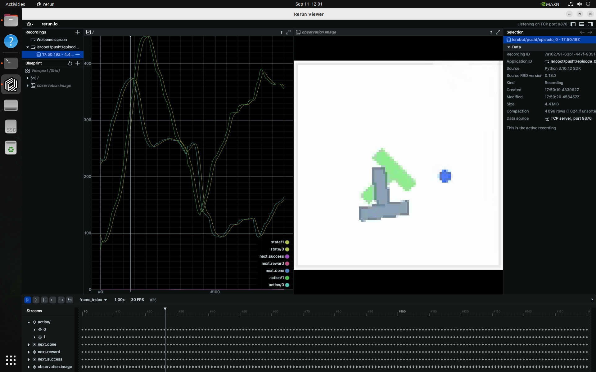

# HuggingFace LeRobot

Let's run HuggingFace [`LeRobot`](https://github.com/huggingface/lerobot/) to train Transformer-based [action diffusion](https://diffusion-policy.cs.columbia.edu/) policies and [ACT](https://github.com/tonyzhaozh/act) onboard NVIDIA Jetson.  These models learn to predict actions for a particular task from visual inputs and prior trajectories, typically collected during teleoperation or in simulation.


!!! abstract "What you need"

    1. One of the following Jetson devices:

        <span class="blobDarkGreen4">Jetson AGX Orin (64GB)</span>
        <span class="blobDarkGreen5">Jetson AGX Orin (32GB)</span>
        <span class="blobLightGreen3">Jetson Orin NX (16GB)</span>
        <span class="blobLightGreen4">Jetson Orin Nano (8GB)</span><span title="Orin Nano 8GB can run Llava-7b, VILA-7b, and Obsidian-3B">⚠️</span>

    2. Running one of the following versions of [JetPack](https://developer.nvidia.com/embedded/jetpack):

        <span class="blobPink2">JetPack 6 GA (L4T r36.3)</span> <span class="blobPink1">JetPack 6.1 (L4T r36.4)</span>

    3. <span class="markedYellow">NVMe SSD **highly recommended**</span> for storage speed and space

        - `16.5GB` for [`lerobot`](https://hub.docker.com/r/dustynv/lerobot) container image
        - Space for models (`>2GB`)

    4. Clone and setup [`jetson-containers`](https://github.com/dusty-nv/jetson-containers/blob/master/docs/setup.md){:target="_blank"}:

		```bash
		git clone https://github.com/dusty-nv/jetson-containers
		bash jetson-containers/install.sh
		```

## Preparation before starting `lerobot` container

This section gives the guide on how you can work through the LeRobot official example of [Getting Started with Real-World Robots \(`7_get_started_with_real_robot.md
`\)](https://github.com/huggingface/lerobot/blob/main/examples/7_get_started_with_real_robot.md) on your Jetson.

!!! tip

    It's recommended to work on your Jetson in **monitor-attached** mode.

    `lerobot` is designed to show camera view in windows and playback TTS audio while capturing dataset, so it is more convenient to setup your Jetson with its monitor (and speakers) attached to Jetson.d

### a. Check `jetson-container`'s location

{: style="height:240px;" align=right}

Through out the course of all the workflows of `lerobot`, we will be generating a lot of data, especially for capturing dataset.

We will clone the `lerobot` directory on host and mount the directory in the container to keep all the data persistant, but first make sure your `jetson-containers` directory is placed on your SSD, not on your eMMC or microSD card.

If you have created the `jetson-containers` directory on eMMC or microSD card (likely the case if you first set up your Jetson device without SSD first and later added SSD), then use the `rsync` command to move the entire directory under SSD mount point.

```bash
rsync -aHAX /home/jetson/jetson-containers/ /ssd/jetson-containers/
```

Then run the installer again.

```bash
bash /ssd/jetson-containers/install.sh
```

### b. Create `lerobot` dir on host

As described above, we will setup the `lerobot` directory under `data` directory of `jetson-containers` for monting it inside the container so that generated data persist.

```bash
cd jetson-containers
./packages/robots/lerobot/clone_lerobot_dir_under_data.sh
./packages/robots/lerobot/copy_overlay_files_in_data_lerobot.sh
```

### c. PulseAudio setup

LeRobot's dataset capture flow (`control_robot.py`) utilizes **Speech Dispatcher** to use espeak TTS, in order to give operators audio queues for notifying the status and signaling the next operation. It's actually very helpful.

Speech Dispatcher utilizes Pulse Audio, so rather than just sharing the `/dev/snd` device when `docker run` (which is good for ALSA), we need to add the following arguments.

```bash
   --device /dev/snd \
   -e PULSE_SERVER=unix:${XDG_RUNTIME_DIR}/pulse/native \
   -v ${XDG_RUNTIME_DIR}/pulse:${XDG_RUNTIME_DIR}/pulse \
```

This is already added to `run.sh` of `jetson-containers`, however, we need to edit `/etc/pulse/default.pa` in order to allow the root user access to the socket file.


```bash
sudo vi /etc/pulse/default.pa
```

Find the section loading `module-native-protomocl-unix` and add `auth-anonymous=1`

```bash
### Load several protocols
.ifexists module-esound-protocol-unix.so
load-module module-esound-protocol-unix auth-anonymous=1
.endif
load-module module-nativ
```

Then restart PulseAudio service to make the config take effect.

```bash
pulseaudio --kill
pulseaudio --start
```

> For troubleshootings or details, please check the [`docs.md`](https://github.com/dusty-nv/jetson-containers/blob/dev/packages/speech/speech-dispatcher/docs.md) of `speech-dispatcher` package.

### d. Set udev rule for ACM devices

It is more convenient if the lerobot programs can always find the device of leader and follower arm with unique names.

For that, we set an udev rule so that arms always get assigned the same device name as following.<br>
This is first done on Jetson host side.

- `/dev/ttyACM_kochleader`   : Leader arm
- `/dev/ttyACM_kochfollower` : Follower arm

First only connect the leader arm to Jetson and record the serial ID by running the following:

```bash
ll /dev/serial/by-id/
```

The output should look like this.

```bash
lrwxrwxrwx 1 root root 13 Sep 24 13:07 usb-ROBOTIS_OpenRB-150_BA98C8C350304A46462E3120FF121B06-if00 -> ../../ttyACM1
```

Then edit the first line of `./99-usb-serial.rules` like the following.

You can find the template of this file under `./packages/robots/lerobot` directory.

```
SUBSYSTEM=="tty", ATTRS{idVendor}=="2f5d", ATTRS{idProduct}=="2202", ATTRS{serial}=="BA98C8C350304A46462E3120FF121B06", SYMLINK+="ttyACM_kochleader"
SUBSYSTEM=="tty", ATTRS{idVendor}=="2f5d", ATTRS{idProduct}=="2202", ATTRS{serial}=="00000000000000000000000000000000", SYMLINK+="ttyACM_kochfollower"
```

First copy this under `/etc/udev/rules.d/` (of host).

```bash
sudo cp ./99-usb-serial.rules /etc/udev/rules.d/
```

Now disconnect the leader arm, and then only connect the follower arm to Jetson. Record the serial for the follower arm.

```bash
$ ll /dev/serial/by-id/
lrwxrwxrwx 1 root root 13 Sep 24 13:07 usb-ROBOTIS_OpenRB-150_483F88DC50304A46462E3120FF0C081A-if00 -> ../../ttyACM0
```

Repeat the same steps to record the serial to edit the lines of `/etc/udev/rules.d/99-usb-serial.rules` file.

```bash
$ sudo vi /etc/udev/rules.d/99-usb-serial.rules
```

You should have `/etc/udev/rules.d/99-usb-serial.rules` now looking like this:

```
SUBSYSTEM=="tty", ATTRS{idVendor}=="2f5d", ATTRS{idProduct}=="2202", ATTRS{serial}=="BA98C8C350304A46462E3120FF121B06", SYMLINK+="ttyACM_kochleader"
SUBSYSTEM=="tty", ATTRS{idVendor}=="2f5d", ATTRS{idProduct}=="2202", ATTRS{serial}=="483F88DC50304A46462E3120FF0C081A", SYMLINK+="ttyACM_kochfollower"
```

Finally make sure the file is under `/etc/udev/rules.d/` (of host), and restart Jetson.

```
sudo ls -l /etc/udev/rules.d/99-usb-serial.rules
sudo reboot
```

After reboot, check if we now have achieved the desired fixed simlinks names for the arms.

```bash
ls -l /dev/ttyACM*
```

You should get something like this:

```bash
crw-rw---- 1 root dialout 166, 0 Sep 24 17:20 /dev/ttyACM0
crw-rw---- 1 root dialout 166, 1 Sep 24 16:13 /dev/ttyACM1
lrwxrwxrwx 1 root root         7 Sep 24 17:20 /dev/ttyACM_kochfollower -> ttyACM0
lrwxrwxrwx 1 root root         7 Sep 24 16:13 /dev/ttyACM_kochleader -> ttyACM1
```

### e. (Optional) CSI cameras

{: style="height:240px;" align=right}

If you plan to use CSI cameras (not USB webcams) for data capture, you will use the new `--csi2webcam` options of `jetson-containers`, which exposes V4L2loopback devices that performs like USB webcams (MJPEG) for CSI cameras using Jetson's hardware JPEG encoder.

This feature require some packages to be installed.

```bash
sudo apt update && sudo apt install v4l2loopback-dkms v4l-utils
```

### f. Increase the swap file size

You may ran out of memory when are setting up to perform ACT model training.

```bash
swapoff -a -v
sudo rm /swfile
sudo systemctl disable nvzramconfi
sudo fallocate -l 8G /ssd/8GB.swap
sudo chmod 600 /ssd/8GB.swap
sudo mkswap /ssd/8GB.swap
sudo echo "/ssd/8GB.swap swap swap defaults 0 0" >> /etc/fstab
sudo reboot
```

### g. Starting the `lerobot` container

=== "USB webcams"

    ```bash
    cd jetson-containers
    jetson-containers run -v ${PWD}/data/lerobot/:/opt/lerobot/ $(autotag lerobot)
    ```

=== "CSI cameras"

    ```bash
    cd jetson-containers
    ./run.sh \
      --csi2webcam --csi-capture-res='1640x1232@30' --csi-output-res='640x480@30' \
      -v ${PWD}/data/lerobot/:/opt/lerobot/ \
      $(./autotag lerobot)
    ```

## Workflow in `lerobot` container

!!! tip "Bash history tip"

    Inside the container, on the console, you can press ++up++ key to scroll through some of the frequently used commands pre-registered in bash history.

### q. Setup audio

Check if PulseAudio is available.

```bash
pactl info
```

If you need to set the default audio output device, use `set-default-sink`.

```bash
pactl list short sinks
pactl set-default-sink [SINK_NAME_OR_INDEX]
```

### 1. Order and Assemble

=== "SO-100 arm"

    You can order the SO-100 arm kits from Seeed Studio.

    - Servo motor kit
        - [SO-ARM100 Low-Cost AI Arm Servo Motor Kit for LeRobot](https://www.seeedstudio.com/SO-ARM100-Low-Cost-AI-Arm-Kit.html)
        - [SO-ARM100 Low-Cost AI Arm Servo Motor Kit Pro for LeRobot](https://www.seeedstudio.com/SO-ARM100-Low-Cost-AI-Arm-Kit-Pro-p-6343.html)
    - 3D printed parts
        - [SO-ARM100 Low-Cost AI Arm 3D Printed Skeleton](https://www.seeedstudio.com/SO-ARM100-3D-printed-Enclosure-p-6409.html)

    Check the official [Assembly tutorial](https://github.com/huggingface/lerobot/blob/main/examples/10_use_so100.md#d-step-by-step-assembly-instructions).

=== "Koch arm"

    You can order the Koch v1.1 kits from ROBOTIS. (*Note: they don't come with 3d printed parts*)

    - [Follower arm](https://www.robotis.us/koch-v1-1-low-cost-robot-arm-follower/)
    - [Leader arm](https://www.robotis.us/koch-v1-1-low-cost-robot-arm-follower/)

### 2. Configure motors, calibrate arms, teleoperate your Koch v1.1

=== "SO-100 arm"

    Follow the official tutorials.

    - [Configure the motors](https://github.com/huggingface/lerobot/blob/main/examples/10_use_so100.md#c-configure-the-motors)
    - [Calibrate](https://github.com/huggingface/lerobot/blob/main/examples/10_use_so100.md#e-calibrate)

        <iframe width="560" height="315" src="https://www.youtube.com/embed/FioA2oeFZ5I?si=98gzLQiJ0VY_nGH0&amp;start=724" title="YouTube video player" frameborder="0" allow="accelerometer; autoplay; clipboard-write; encrypted-media; gyroscope; picture-in-picture; web-share" referrerpolicy="strict-origin-when-cross-origin" allowfullscreen></iframe>

    - [Teleoperate](https://github.com/huggingface/lerobot/blob/main/examples/10_use_so100.md#e-calibrate)

=== "Koch arm"

    Follow the [official tutorial](https://github.com/huggingface/lerobot/blob/main/examples/7_get_started_with_real_robot.md#2-configure-motors-calibrate-arms-teleoperate-your-koch-v11).

    <iframe width="560" height="315" src="https://www.youtube.com/embed/8drnU9uRY24?si=JCsDMSwOJ11MpgyL" title="YouTube video player" frameborder="0" allow="accelerometer; autoplay; clipboard-write; encrypted-media; gyroscope; picture-in-picture; web-share" referrerpolicy="strict-origin-when-cross-origin" allowfullscreen></iframe>

    > Optionally, you can refer and use the Jupyter notebook `7-2_real-robot_configure-motors.ipynb`.

### 3. Record your Dataset and Visualize it

=== "SO-100 arm"

    You should mostly operate on the container's terminal.

    Follow the official tutorial to

    - [record a dataset](https://github.com/huggingface/lerobot/blob/main/examples/10_use_so100.md#g-record-a-dataset), and
    - [visualize a dataset](https://github.com/huggingface/lerobot/blob/main/examples/10_use_so100.md#h-visualize-a-dataset).

=== "Koch arm"

    You should mostly operate on the container's terminal.

    Follow the [official document's section](https://github.com/huggingface/lerobot/blob/main/examples/7_get_started_with_real_robot.md#3-record-your-dataset-and-visualize-it).

!!! tip

    Following template command to **record a dataset** is registered in Bash history inside the `lerobot` container.

    > TODO:
    >
    > - [x] Update the following command
    >     - [ ] Update the bash history in `jetson-container`
    > - [ ] Use a env variable for `HF_USER`

    ```bash
    wandb login
    export HF_USER=
    export ROBOT_TYPE=so100 #or, koch
    python lerobot/scripts/control_robot.py \
        --robot.type=${ROBOT_TYPE} \
        --control.type=record \
        --control.single_task="Grasp a lego block and put it in the bin." \
        --control.fps 30 \
        --control.repo_id ${HF_USER}/test_$(date +%Y%m%d_%H%M%S) \
        --control.tags '["tutorial"]' \
        --control.warmup-time-s 5 \
        --control.episode-time-s 30 \
        --control.reset-time-s 30 \
        --control.num-episodes 10 \
        --control.push_to_hub=true
    ```

!!! tip "Camera config tip"

    The official document demonstrates the two camera positions, one at the top ("phone") and the other at directly in front facing the arm ("laptop").

    In our trials, this camera placement worked, but we needed to make the camera zoom-up to the scene so that they capture better spacial resolution.

    Another thing worth experimenting is the **wrist cam**. More to come later.


!!! tip

    If you plan to perform training on a different machine, `scp` the dataset directory.

    === "To another Jetson"

        ```bash
        scp -r data/lerobot/data/${HF_USER}/test_01/ <USER>@<IP>:/ssd/jetson-containers/data/lerobot/data/${HF_USER}/
        ```

    === "To other PC"

        ```bash
        scp -r data/lerobot/data/${HF_USER}/test_01/ <USER>@<IP>:/home/<USER>/lerobot/data/${HF_USER}/
        ```

### 4. Train a policy on your data

You should operate on other container's terminal.

=== "SO-100 arm"

    You should mostly operate on the container's terminal.

    Follow the official tutorial to

    - [record a dataset](https://github.com/huggingface/lerobot/blob/main/examples/10_use_so100.md#g-record-a-dataset), and
    - [visualize a dataset](https://github.com/huggingface/lerobot/blob/main/examples/10_use_so100.md#h-visualize-a-dataset).

=== "Koch arm"

    Follow the [official document's section](https://github.com/huggingface/lerobot/blob/main/examples/7_get_started_with_real_robot.md#4-train-a-policy-on-your-data).


!!! tip

    ```bash
    wandb login
    DATA_DIR=data python lerobot/scripts/train.py \
        --dataset_repo_id=${HF_USER}/koch_test \
        --policy.type=act \
        --output_dir=outputs/train/act_koch_test \
        --job_name=act_koch_test \
        --device=cuda \
        --wandb.enable=true
    ```

!!! tip

    If you perform the training on other Jetson or PC, `scp` the outputs directory content back to the orinal Jetson that has the leader and follower arm attached.

    ```bash
    scp -r outputs/train/act_koch_test_01/ <USER>@<IP>:/ssd/jetson-containers/data/lerobot/outputs/train/
    ```

### 5. Evaluate your policy

You should operate on the container's terminal.

Follow the [official document's section](https://github.com/huggingface/lerobot/blob/main/examples/7_get_started_with_real_robot.md#3-record-your-dataset-and-visualize-it).

!!! tip "Tip for **a. Use `koch.yaml` and our `record` function**"

    Modify the command in the bash history to add `-p` arugment to points to the policy checkpoint.

    ```bash
    python lerobot/scripts/control_robot.py record \
      --robot-path lerobot/configs/robot/koch.yaml \
      --fps 30 \
      --root data \
      --repo-id ${HF_USER}/eval_koch_test_01 \
      --tags tutorial eval \
      --warmup-time-s 5 \
      --episode-time-s 30 \
      --reset-time-s 30 \
      --num-episodes 10 \
      -p outputs/train/act_koch_test/checkpoints/last/pretrained_model \
      --run-compute-stats 0
    ```

!!! tip "Tip for **Visualize evaluation afterwards**"

    ```bash
    python lerobot/scripts/visualize_dataset.py \
      --root data \
      --repo-id ${HF_USER}/eval_koch_test
    ```


If everything goes well, you should see

<video controls autoplay muted style="max-width: 960px">
    <source src="https://github.com/user-attachments/assets/1ec6e4f0-0f85-4a8a-85c0-f70019f3405b" type="video/mp4">
</video>


## Basic Walkthrough

This is from the lerobot top README.md.

### Visualize Datasets

Outside of container, first launch the [rerun.io](https://rerun.io/) visualization tool that LeRobot uses <sup>[[↗]](https://github.com/huggingface/lerobot/?tab=readme-ov-file#visualize-datasets)</sup>

```bash
pip3 install rerun-sdk
rerun
```

Then, start the docker container to playback one of [these](https://huggingface.co/datasets?other=LeRobot) LeRobot datasets.

```bash
jetson-containers run -w /opt/lerobot $(autotag lerobot) \
  python3 lerobot/scripts/visualize_dataset.py \
    --repo-id lerobot/pusht \
    --episode-index 0
```



### Evaluate a Pretrained Diffusion Policy

This will download and run a pre-trained [diffusion model](https://huggingface.co/lerobot/diffusion_pusht) on the [PushT](https://github.com/huggingface/gym-pusht) environment <sup>[[↗]](https://github.com/huggingface/lerobot/?tab=readme-ov-file#evaluate-a-pretrained-policy)</sup>

```bash
jetson-containers run -w /opt/lerobot $(autotag lerobot) \
  python3 lerobot/scripts/eval.py \
    -p lerobot/diffusion_pusht \
    eval.n_episodes=10 \
    eval.batch_size=10
```

### Train your own ACT Policy

Next, train [ACT](https://github.com/tonyzhaozh/act) on the [Aloha](https://github.com/huggingface/gym-aloha) manipulation environment <sup>[[↗]](https://github.com/huggingface/lerobot/?tab=readme-ov-file#train-your-own-policy)</sup>

```bash
jetson-containers run -w /opt/lerobot $(autotag lerobot) \
  python3 lerobot/scripts/train.py \
    policy=act \
    env=aloha \
    env.task=AlohaInsertion-v0 \
    dataset_repo_id=lerobot/aloha_sim_insertion_human
```

See [Trossen Robotics](https://www.trossenrobotics.com/aloha-kits) for dual-arm ALOHA kits, and [Robotis](https://www.robotis.us/project-bundles/) for the low-cost [Koch v1.1](https://github.com/jess-moss/koch-v1-1) kit used in the [LeRobot tutorial](https://github.com/huggingface/lerobot/blob/main/examples/7_get_started_with_real_robot.md):

<a href="https://github.com/huggingface/lerobot/blob/main/examples/7_get_started_with_real_robot.md"></a>
> HuggingFace LeRobot - Get Started with Real-World Robots ([YouTube Playlist](https://www.youtube.com/playlist?list=PLo2EIpI_JMQu5zrDHe4NchRyumF2ynaUN))

